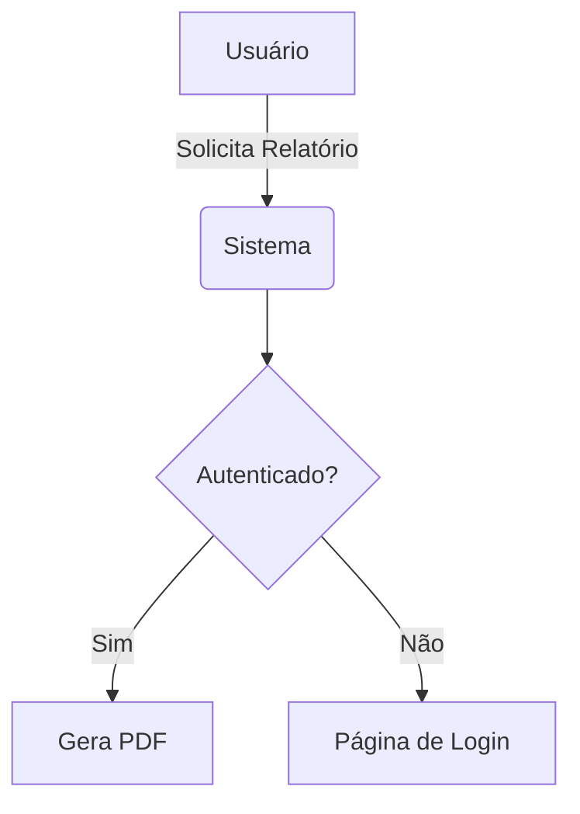

## Relatório de Levantamento de Requisitos: 

## 1. 🧠 Brainstorming (Elicitação Inicial)
*Registro das ideias e necessidades levantadas durante a dinâmica de grupo.*

- **Ideia Central:** [Descreva o propósito principal]
- **Principais Insights:**
    - [ ] Ponto levantado pelo Stakeholder A
    - [ ] Necessidade crítica identificada
    - [ ] Oportunidade de melhoria

---

## 2. 📋 Especificação de Requisitos

### 2.1. Requisitos Funcionais (RF)
*Ações e comportamentos que o sistema deve executar.*

| ID | Requisito | Descrição | Prioridade |
|:---|:---|:---|:---:|
| RF01 | Login | Permitir acesso via e-mail e senha. | Alta |
| RF02 | Exportação | Gerar relatórios em formato PDF e CSV. | Média |

### 2.2. Requisitos Não Funcionais (RNF)
*Atributos de qualidade e restrições técnicas.*

| ID | Categoria | Descrição |
|:---|:---|:---|
| RNF01 | Desempenho | O sistema deve suportar 100 acessos simultâneos. |
| RNF02 | Segurança | Os dados devem ser trafegados via protocolo HTTPS. |

---

## 3. 📊 Diagramas (Arquitetura e Processos)
*Representação visual da estrutura (Utilizando sintaxe Mermaid).*

---

## 4. 🎨 Prototipagem
*Links e referências para a interface visual.*

- **Baixa Fidelidade:** [Link para o Wireframe/Desenho]
- **Alta Fidelidade:** [Link para o Figma/Adobe XD]
- **Fluxo do Protótipo:** Descrição breve de como o usuário navega entre as telas principais.

---

## 5. 📑 Relatórios Técnicos
*Estrutura de dados e logs que o sistema deve fornecer.*

- **Relatório de Atividade:** Lista de ações executadas por período.
- **Relatório de Erros (Logs):** Registro de falhas críticas para a equipe de TI.
- **Métricas de Sucesso:** [Ex: Tempo médio de resposta, Volume de vendas].

---

## 📝 Conclusão e Próximos Passos
1. [ ] Validar RFs com o cliente.
2. [ ] Iniciar desenho do banco de dados.
3. [ ] Testar protótipo de alta fidelidade com usuários.

---
*Documento gerado em: 22/05/2024*